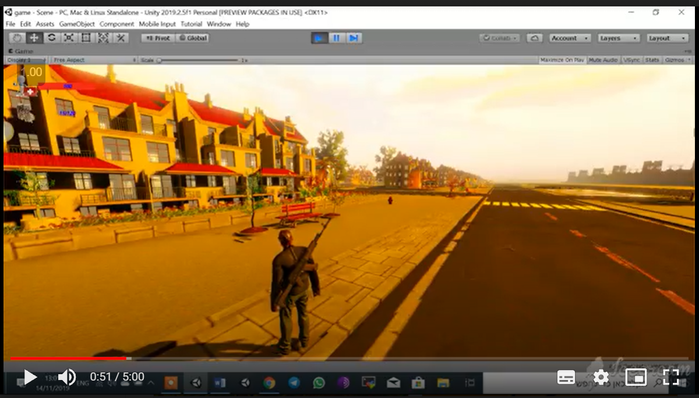

# FPS-Game

FPS style game. The game is still under development. There is currently a human-shaped player, a number of weapons and ammunition, a vast play area that includes a variety of buildings, vehicles, trees and vegetation, benches, light poles, roads, bridges and water. Walking, jumping, aiming the weapon, changing among weapons are all possible for the player. Every object in the game has its own sound. There are sounds for fire, water, waterfalls, a door opening, and shooting. Walking through grass or on vegetation produces different sounds. The work on the game included graphic design in a variety of programs, creating animated movements for the player, etc.
#### It was developed on the Unity platform using C# programming language.

### Files:
Here you will find mostly code files. The graphics, animation files, and packages used in this project are not included because of space limitations.

### Future development:
The game will also be further developed by adding a menu, levels, game logic, fighter jets, missiles, civilians, birds, and options to enter and exit all vehicles. A form of artificial intelligence will guide the movement of cars, trains, civilians, and birds.

<a href="https://drive.google.com/file/d/1kdLs7ZJMRZ5cBwXQopiBGJcWhhuAVpVK/view?usp=sharing">Click to see video 1.</a>
<a href="https://drive.google.com/file/d/1Jf6LLZn53ZcPKEfotTlRgA0Zg9Op1sKg/view?usp=sharing">Click to see video 2.</a>

**Snapshots**

-----------------------------
